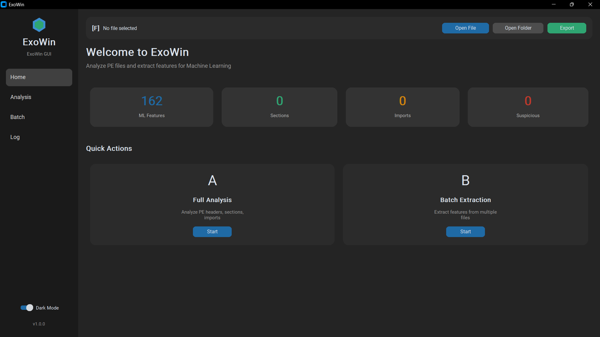

# ExoWin

<p align="center">
  
  
  
  
</p>

<p align="center">
  <b>Static Analysis and Feature Extraction Tool for PE (Portable Executable) Files</b>
</p>

<p align="center">
  <i>ExoWin is a powerful tool for static analysis of Windows executables (.exe, .dll), supporting both Command Line Interface (CLI) and Graphical User Interface (GUI). Designed for security researchers, malware analysts, and machine learning practitioners.</i>
</p>

---

## Screenshot

<p align="center">
  
</p>

---

## Table of Contents

- [Features](#features)
- [Installation](#installation)
- [Usage](#usage)
  - [Graphical User Interface (GUI)](#graphical-user-interface-gui)
  - [Command Line Interface (CLI)](#command-line-interface-cli)
- [CLI Commands](#cli-commands)
- [Export Formats](#export-formats)
- [ML Feature Extraction](#ml-feature-extraction)
- [Project Structure](#project-structure)
- [System Requirements](#system-requirements)
- [License](#license)

---

## Features

### Comprehensive Analysis
- **File Information**: Hash values (MD5, SHA1, SHA256), entropy, imphash, file size
- **PE Headers**: DOS Header, File Header, Optional Header
- **Sections**: Section analysis (.text, .data, .rdata...) with entropy and suspicious indicators
- **Imports/Exports**: List of imported DLLs and APIs, suspicious API detection
- **Strings**: String extraction and categorization (URLs, IPs, Registry keys, File paths...)
- **Disassembly**: Code disassembly from entry point

### Threat Detection
- Suspicious API detection by category (Anti-Debug, Process Injection, Crypto...)
- Abnormal section warnings (high entropy, unusual execution permissions)
- Packed/encrypted indicator detection

### Machine Learning Feature Extraction
- 50+ numerical features for ML models
- CSV export compatible with sklearn, pandas
- Batch processing support

### Multiple Export Formats
- Console (Rich formatting)
- JSON
- HTML (Interactive report)
- Markdown
- CSV

---

## Installation

### Prerequisites
- Python 3.8 or higher
- pip (Python package manager)

### Install dependencies

```bash
# Clone repository
git clone https://github.com/ptg14/ExoWin.git
cd exowin

# Create virtual environment (recommended)
python -m venv venv

# Activate virtual environment
# Windows:
venv\Scripts\activate
# Linux/macOS:
source venv/bin/activate

# Install dependencies
pip install -r requirements.txt
```

### Development Installation

---

## Usage

### Graphical User Interface (GUI)

Launch the GUI:

```bash
python -m exowin gui
```

**GUI Features:**
- Drag and drop PE files for analysis
- Dashboard overview with statistics
- Separate tabs for each information type
- Export reports in multiple formats
- Dark/Light theme support

### Command Line Interface (CLI)

#### Basic Analysis

```bash
# Analyze file and display on console
python -m exowin analyze malware.exe

# Analyze with disassembly
python -m exowin analyze malware.exe --disasm

# Analyze with custom instruction count
python -m exowin analyze malware.exe --disasm --num-instructions 100
```

#### Export Reports

```bash
# Export JSON report
python -m exowin analyze malware.exe -f json -o report.json

# Export HTML report
python -m exowin analyze malware.exe -f html -o report.html

# Export Markdown report
python -m exowin analyze malware.exe -f markdown -o report.md
```

#### Quick Information

```bash
# Basic information
python -m exowin info malware.exe

# Section information
python -m exowin sections malware.exe

# Import information
python -m exowin imports malware.exe

# Show all imports
python -m exowin imports malware.exe --all

# Extract strings
python -m exowin strings malware.exe

# Disassembly
python -m exowin disasm malware.exe --num 50
```

---

## CLI Commands

| Command | Description | Example |
|---------|-------------|---------|
| `gui` | Launch graphical user interface | `python -m exowin gui` |
| `analyze` | Comprehensive PE file analysis | `python -m exowin analyze file.exe` |
| `info` | Display basic information | `python -m exowin info file.exe` |
| `sections` | Display section information | `python -m exowin sections file.exe` |
| `imports` | Display imports and suspicious APIs | `python -m exowin imports file.exe` |
| `strings` | Extract and categorize strings | `python -m exowin strings file.exe` |
| `disasm` | Disassemble from entry point | `python -m exowin disasm file.exe` |
| `compare` | Compare two PE files | `python -m exowin compare file1.exe file2.exe` |
| `batch` | Batch analysis | `python -m exowin batch ./samples ./reports` |
| `extract-features` | Extract ML features | `python -m exowin extract-features file.exe` |
| `batch-extract` | Batch ML extraction | `python -m exowin batch-extract ./samples output.csv` |
| `list-features` | List all ML features | `python -m exowin list-features` |
| `version` | Display version | `python -m exowin version` |

### `analyze` Command Options

| Option | Short | Description | Default |
|--------|-------|-------------|---------|
| `--output` | `-o` | Output file path | None |
| `--format` | `-f` | Output format (console, json, html, markdown) | console |
| `--disasm` | `-d` | Include disassembly | False |
| `--num-instructions` | `-n` | Number of instructions | 40 |

### `batch` Command Options

| Option | Short | Description | Default |
|--------|-------|-------------|---------|
| `--format` | `-f` | Output format (json, html, markdown) | json |
| `--pattern` | `-p` | File search pattern | *.exe |

### `extract-features` Command Options

| Option | Short | Description | Default |
|--------|-------|-------------|---------|
| `--output` | `-o` | Output CSV file path | None |
| `--label` | `-l` | Sample label (malware, benign...) | None |
| `--append` | `-a` | Append to existing CSV file | False |

### `batch-extract` Command Options

| Option | Short | Description | Default |
|--------|-------|-------------|---------|
| `--pattern` | `-p` | File search pattern | *.exe |
| `--label` | `-l` | Label for all samples | None |
| `--recursive` | `-r` | Search recursively | False |

---

## Export Formats

### JSON
Structured format suitable for automated processing and API integration.

```json
{
  "file_info": {
    "name": "malware.exe",
    "size": 123456,
    "md5": "...",
    "sha256": "...",
    "entropy": 7.2
  },
  "sections": [...],
  "imports": [...],
  "suspicious_indicators": [...]
}
```

### HTML
Interactive report with a clean web interface, viewable directly in browsers.

### Markdown
Structured text format suitable for documentation and reports.

### CSV
Tabular data format suitable for Excel analysis or ML pipelines.

---

## ML Feature Extraction

ExoWin provides a powerful feature extraction module for Machine Learning models:

### Feature Categories

| Category | Prefix | Example Features |
|----------|--------|------------------|
| File | `file_` | `file_size`, `file_entropy` |
| DOS Header | `dos_` | `dos_e_magic`, `dos_e_lfanew` |
| File Header | `fh_` | `fh_machine`, `fh_num_sections` |
| Optional Header | `oh_` | `oh_size_of_code`, `oh_entry_point` |
| Sections | `sec_` | `sec_count`, `sec_avg_entropy` |
| Imports | `imp_` | `imp_count`, `imp_dll_count` |
| Exports | `exp_` | `exp_count` |
| Resources | `res_` | `res_count`, `res_size` |
| Data Directory | `dd_` | `dd_has_import`, `dd_has_export` |
| PE Type | `is_` | `is_dll`, `is_exe`, `is_64bit` |

### Single File Extraction

```bash
# Extract and display
python -m exowin extract-features malware.exe

# Extract and save to CSV
python -m exowin extract-features malware.exe -o features.csv

# Extract with label
python -m exowin extract-features malware.exe -o dataset.csv -l malware
python -m exowin extract-features benign.exe -o dataset.csv -l benign --append
```

### Batch Extraction

```bash
# Extract from malware directory
python -m exowin batch-extract ./malware_samples dataset.csv -l malware

# Recursive extraction
python -m exowin batch-extract ./samples dataset.csv -r -p "*.exe"
```

### List Available Features

```bash
python -m exowin list-features
```

---

## Project Structure

```
exowin/
├── __init__.py          # Package initialization
├── __main__.py          # Entry point (python -m exowin)
├── analyzer.py          # Main analysis engine
├── cli.py               # CLI commands (Typer)
├── gui.py               # GUI (CustomTkinter)
├── requirements.txt     # Dependencies
│
├── extractors/          # Feature extractors
│   ├── __init__.py
│   ├── base.py          # Base extractor class
│   ├── file_info.py     # File information extractor
│   ├── headers.py       # PE headers extractor
│   ├── sections.py      # Sections extractor
│   ├── imports.py       # Imports/Exports extractor
│   ├── strings.py       # Strings extractor
│   ├── disasm.py        # Disassembly extractor
│   └── ml_features.py   # ML features extractor
│
├── reporters/           # Report generators
│   ├── __init__.py
│   ├── base.py          # Base reporter class
│   ├── console_reporter.py   # Console output (Rich)
│   ├── json_reporter.py      # JSON export
│   ├── html_reporter.py      # HTML report
│   ├── markdown_reporter.py  # Markdown export
│   └── csv_reporter.py       # CSV export
│
└── utils/               # Utility functions
    ├── __init__.py
    └── pe_loader.py     # PE file loader
```

---

## System Requirements

### Operating System
- Windows 10/11 (recommended)
- Linux (partial support)
- macOS (partial support)

### Python
- Python 3.8 or higher

### Core Dependencies

| Package | Description |
|---------|-------------|
| `typer[all]` | CLI framework |
| `rich` | Console formatting |
| `pefile` | PE file parsing |
| `capstone` | Disassembly engine |
| `ppdeep` | Fuzzy hashing |
| `customtkinter` | Modern GUI |
| `pillow` | Image processing |
| `jinja2` | HTML template engine |

---

## Advanced Usage

### Python Integration

```python
from exowin import PEStaticAnalyzer
from exowin.extractors import MLFeaturesExtractor
from exowin.reporters import JSONReporter

# Analyze file
analyzer = PEStaticAnalyzer()
result = analyzer.analyze_file("malware.exe", include_disasm=True)

# Export report
reporter = JSONReporter()
reporter.generate(result, "report.json")

# Extract ML features
import pefile
pe = pefile.PE("malware.exe")
ml_extractor = MLFeaturesExtractor()
features = ml_extractor.extract(pe, "malware.exe")
pe.close()
```

### File Comparison

```bash
python -m exowin compare original.exe packed.exe
```

Output includes:
- File information comparison (hash, entropy)
- Section comparison
- Suspicious indicator comparison

---

---

## License

This project is distributed under the MIT License. See `LICENSE` file for more details.

---

## Contact

- **Issues**: [GitHub Issues](https://github.com/ptg14/ExoWin/issues)

---

<p align="center">
  <b>Have fun!!!</b>
</p>
